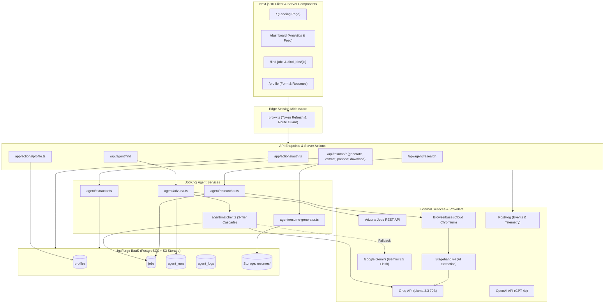
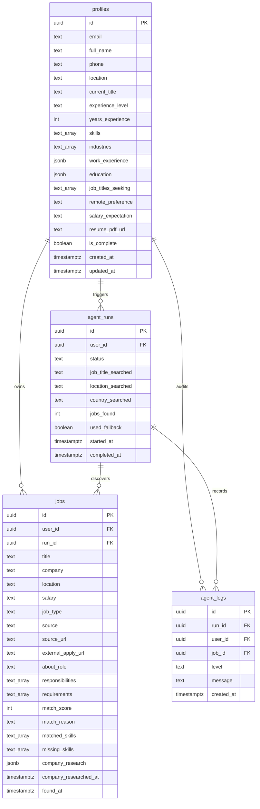

# JobKhoj

An autonomous, full-stack AI career agent that eliminates the manual grind of job hunting. JobKhoj discovers relevant tech openings, scores role alignment against candidate profiles using a resilient multi-tier LLM cascade, executes autonomous cloud browser sessions to build deep company research dossiers, generates polished PDF resumes, and aggregates telemetry on an interactive analytics dashboard.

---

## Overview

Job hunting is traditionally fragmented and time-consuming: candidates spend hours parsing job boards, interpreting ambiguous role requirements, digging through company engineering blogs, and manually modifying resumes.

**JobKhoj** automates the entire preparation lifecycle:
1. **Profile & Resume Intelligence**: Parses uploaded PDF resumes into structured candidate profiles using multi-provider AI extraction, or reverse-engineers profile data into publication-ready, single-page PDF resumes using `@react-pdf/renderer`.
2. **Intelligent Job Discovery**: Queries live listings via the Adzuna API and scores each opportunity from 0–100 against candidate experience using a 3-tier fallback cascade (Groq &rarr; Gemini &rarr; Heuristic) wrapped in circuit breakers.
3. **Autonomous Deep Company Research**: Dispatches headless cloud browser agents (Browserbase + Stagehand v4) to follow recruiter redirects, inspect employer homepages, and scrape about/engineering pages to synthesize 9-dimension interview dossiers.
4. **Real-Time Activity & Analytics**: Visualizes discovery trajectories, match distributions, and research cadences on a dedicated dashboard powered by deterministic UTC aggregations and PostHog telemetry.

---

## Features

### 1. Candidate Profile & Resume Suite
- **Interactive Profile Builder**: Modular forms covering personal details, seniority level, skills/industry tags, employment history, education, and search preferences.
- **AI Resume Extraction**: Upload any existing PDF resume; the agent parses the raw stream with `pdf-parse` and structures it into strongly-typed profile JSON via multi-provider LLMs.
- **Dynamic PDF Resume Generator**: Compiles candidate profile records into an AI-polished, single-page A4 document rendered via `@react-pdf/renderer` and persisted in InsForge Storage.
- **Secure File Preview & Streaming**: Authenticated endpoints (`/api/resume/preview` and `/api/resume/download`) to stream or download resumes directly without leaking private storage URLs.

### 2. Autonomous Job Discovery & 3-Tier Matcher
- **Live Search Integration**: Queries Adzuna's API across IT categories with support for US, UK, Australia, and Canada (`us`, `gb`, `au`, `ca`).
- **3-Tier AI Scoring Cascade**:
  - **Tier 1 (Groq)**: Ultra-fast Llama-3.3-70B inference returning scores, match rationales, and skill delta mappings in under 2 seconds.
  - **Tier 2 (Google Gemini)**: Automatic failover to Gemini 3.5 Flash if Tier 1 encounters rate limits or timeouts.
  - **Tier 3 (Heuristic Engine)**: Fully offline, zero-dependency token-overlap algorithm ensuring no search fails even during total upstream API outages.
- **Circuit Breaker Protection**: Dynamically disables failing LLM providers per batch to conserve latency and protect rate limits.
- **Search Run Auditing**: Every discovery run creates dedicated audit trails in `agent_runs` and logs lifecycle events in `agent_logs`.

### 3. Company Research Agent
- **Canonical Domain Extraction**: Unwinds Adzuna tracking redirects (`extractRootDomain`) through server-side HEAD/GET probes to locate real employer root domains.
- **Headless Cloud Browsing**: Spins up Browserbase sessions driven by Stagehand v4 to navigate homepages and priority sub-pages (`/about`, `/engineering`, `/product`, `/blog`).
- **9-Field Strategic Dossier**:
  - `companyOverview`: Mission, business model, and operational scale.
  - `techStack`: Extracted languages, frameworks, cloud infra, and tools.
  - `culture`: Team norms, values, and collaboration models.
  - `whyThisRole`: Organizational context behind the open position.
  - `yourEdge`: Candidate strengths mapped directly to company requirements.
  - `gapsToAddress`: Tactical framing strategies for missing skills.
  - `smartQuestions`: Tailored high-signal interview questions.
  - `interviewPrep`: Concrete focus topics and architectural patterns.
  - `sources`: Verified external URLs used to assemble the dossier.
- **Resilient Fallback**: Gracefully degrades to job description synthesis if employer sites block automated crawlers.

### 4. Real-Time Dashboard & Analytics
- **Live Performance Metrics**:
  - *Total Jobs Discovered*
  - *Average Match Rate* (percentage across all scored opportunities)
  - *Companies Researched* (verified dossier count)
  - *Jobs Discovered This Week* (including week-over-week velocity indicators)
- **Chronological Activity Feed**: Merged stream combining discovery operations and research completions with relative human timestamps.
- **Zero-Filled Visualization Suite (Recharts)**:
  - *Jobs Over Time*: 30 continuous UTC calendar days with explicit zero-filling.
  - *Match Score Distribution*: Segmented across 5 discrete tiers (50–60%, 60–70%, 70–80%, 80–90%, 90–100%).
  - *Research Velocity*: 7-day trailing activity anchored by `company_researched_at`.
  - *Independent Empty States*: Custom visual fallbacks for each widget when data is sparse.

---

## Tech Stack

| Layer | Technology | Version | Purpose |
|---|---|---|---|
| **Core Framework** | Next.js (App Router) | `16.3.1` | React full-stack framework with Turbopack support |
| **Frontend Library** | React / React DOM | `19.2.8` | Component rendering and server components |
| **Language** | TypeScript | `^5.0.0` | Strict static typing across front and backend |
| **Backend as a Service** | InsForge SDK (`@insforge/sdk`) | `^1.5.2` | PostgreSQL DB, PostgREST API, OAuth, Storage |
| **Styling** | Tailwind CSS / PostCSS | `^4.0.0` | Utility-first responsive design tokens |
| **Headless Cloud Browser**| Browserbase SDK | `^2.18.0` | Remote browser infrastructure |
| **AI Web Automation** | Stagehand (`@browserbasehq/stagehand`) | `^4.0.2` | DOM understanding and structured content extraction |
| **LLM Orchestration** | OpenAI SDK | `^7.5.0` | Unified client for Groq, Gemini, OpenRouter, and OpenAI |
| **Document Generation** | `@react-pdf/renderer` | `^4.8.1` | Client/server single-page PDF document generation |
| **Document Parsing** | `pdf-parse` | `^2.4.5` | In-memory binary PDF text extraction |
| **Data Visualization** | Recharts | `^3.10.1` | Composable SVG analytics and chart primitives |
| **Iconography** | Lucide React | `^1.34.0` | Consistent UI icon sets |
| **Telemetry & Product Analytics**| PostHog (`posthog-js`, `posthog-node`) | `^1.419.4` / `^5.51.2` | Event dispatching and analytics query proxy |
| **Schema Validation** | Zod | `^4.4.3` | Runtime type safety and payload validation |

---

## Architecture Overview



---

## Project Structure

```
jobpilot/
├── .agents/                      # Agent instruction files and context overrides
├── .insforge/                    # InsForge project configuration
│   └── project.json
├── agent/                        # Autonomous AI Agent engine (zero UI dependencies)
│   ├── adzuna.ts                 # Adzuna API caller, batching, and run orchestrator
│   ├── extractor.ts              # Resume text-to-JSON parsing cascade
│   ├── matcher.ts                # 3-tier scoring cascade (Groq -> Gemini -> Heuristic)
│   ├── researcher.ts             # Cloud browser crawler & 9-field dossier synthesizer
│   └── resume-generator.ts       # Profile-to-PDF polishing and structuring logic
├── app/                          # Next.js 16 App Router pages and route handlers
│   ├── actions/                  # Server Actions for transactional mutations
│   │   ├── auth.ts               # OAuth initiation and sign-out logic
│   │   └── profile.ts            # Profile upsert, completeness, and storage hooks
│   ├── api/                      # Backend REST API routes
│   │   ├── agent/
│   │   │   ├── find/route.ts     # Dispatches job discovery agent
│   │   │   └── research/route.ts # Dispatches company research agent
│   │   ├── auth/callback/        # OAuth callback handling
│   │   └── resume/               # Resume management routes
│   │       ├── download/route.ts # Authenticated resume download
│   │       ├── extract/route.ts  # Text extraction from uploaded PDF
│   │       ├── generate/route.ts # AI polishing & PDF compilation
│   │       └── preview/route.ts  # In-browser authenticated PDF streaming
│   ├── dashboard/page.tsx        # Dashboard page with metrics & activity
│   ├── find-jobs/
│   │   ├── page.tsx              # Job discovery, filters, search, and list view
│   │   └── [id]/page.tsx         # Detailed job view & company research dossier
│   ├── login/page.tsx            # OAuth authentication screen
│   ├── profile/page.tsx          # Candidate profile form & resume workspace
│   ├── layout.tsx                # Root layout with PostHog and global styling
│   └── page.tsx                  # Public landing homepage
├── components/                   # Modular React UI components
│   ├── dashboard/                # StatCards, ActivityCard, and Recharts components
│   ├── find-jobs/                # SearchControls, Table, FilterBar, and Pagination
│   ├── job-details/              # JobHeader, MatchReasoning, SkillsComparison, Dossier
│   ├── profile/                  # Form sections, completion meter, and upload zone
│   ├── providers/                # PostHog client context providers
│   ├── resume/                   # ResumePdfDocument (@react-pdf/renderer layout)
│   └── Navbar.tsx                # Global top-level responsive navigation bar
├── context/                      # Specification documents, build plans, and UI tokens
├── lib/                          # Shared utilities and SDK initializations
│   ├── adzuna.ts                 # Adzuna API client and mock data provider
│   ├── browserbase.ts            # Browserbase cloud session factory
│   ├── dashboard-activity.ts     # Activity merger and relative time formatters
│   ├── dashboard-analytics.ts    # 30-day/7-day zero-filled UTC aggregation engine
│   ├── dashboard-stats.ts        # User-scoped metrics and WoW trend calculations
│   ├── insforge-client.ts        # Client-side InsForge instance
│   ├── insforge-server.ts        # SSR/Server Component InsForge instance
│   ├── openai.ts                 # Multi-provider LLM factory (Groq, Gemini, OpenRouter, OpenAI)
│   ├── pdf-parser.ts             # Buffer-to-text PDF extractor
│   ├── posthog-client.ts         # Client-side telemetry initialization
│   └── posthog-server.ts         # Server-side event dispatching client
├── proxy.ts                      # Next.js 16 edge session & auth middleware
├── scratch/                      # Automated test scripts and verification suites
├── types/                        # Global TypeScript models and contracts
│   ├── company-research.ts       # Dossier schema and failure reason types
│   ├── find-jobs.ts              # Job listings, filters, and run models
│   ├── index.ts                  # Profile, experience, and education types
│   └── job-details.ts            # Extended job view interfaces
└── package.json                  # Dependencies, engine constraints, and scripts
```

---

## Installation

### Prerequisites
- **Node.js**: `v20.x` or higher recommended
- **Package Manager**: `npm` (v10+), `pnpm`, or `yarn`
- **InsForge Project**: Accessible PostgreSQL backend with PostgREST and S3-compatible storage
- **External API Keys**:
  - *Job Search*: Adzuna API credentials (`ADZUNA_APP_ID`, `ADZUNA_APP_KEY`)
  - *Cloud Browsing*: Browserbase credentials (`BROWSERBASE_PROJECT_ID`, `BROWSERBASE_API_KEY`)
  - *AI Inference*: At least one valid key from Groq, Google Gemini, OpenRouter, or OpenAI

### 1. Clone the Repository
```bash
git clone https://github.com/saichetanM98/Job_khoj.git
cd Job_khoj/jobpilot
```

### 2. Install Dependencies
```bash
npm install
```

---

## Configuration

Create a `.env.local` file in the root directory:

```bash
cp .env.example .env.local
```

### Environment Variables Reference

| Variable | Required | Default | Description |
|---|:---:|---|---|
| `NEXT_PUBLIC_INSFORGE_URL` | **Yes** | — | InsForge backend project URL (e.g. `https://xxxx.insforge.app`) |
| `NEXT_PUBLIC_INSFORGE_ANON_KEY` | **Yes** | — | Public anonymous API key for InsForge PostgREST and Auth |
| `INSFORGE_PROJECT_URL` | **Yes** | — | Canonical backend URL for server-side invocations |
| `NEXT_PUBLIC_APP_URL` | **Yes** | `http://localhost:3000` | Application base URL used for OAuth callback redirects |
| `GROQ_API_KEY` | Recommended | — | Groq API key (starts with `gsk_`) for ultra-fast Tier 1 matching |
| `GEMINI_API_KEY` | Recommended | — | Google Gemini API key for Tier 2 fallback inference |
| `OPENROUTER_API_KEY` | Optional | — | OpenRouter key (starts with `sk-or-`) for multi-model access |
| `OPENAI_API_KEY` | Optional | — | OpenAI API key (starts with `sk-`) for GPT-4o access |
| `ADZUNA_APP_ID` | **Yes** | — | Adzuna Developer Application ID |
| `ADZUNA_APP_KEY` | **Yes** | — | Adzuna Developer API Key |
| `ALLOW_MOCK_FALLBACK` | Optional | `true` | When set to `false`, forces Adzuna API errors instead of mock jobs |
| `BROWSERBASE_PROJECT_ID` | **Yes** | — | Browserbase Project UUID for headless sessions |
| `BROWSERBASE_API_KEY` | **Yes** | — | Browserbase live API key (starts with `bb_live_`) |
| `NEXT_PUBLIC_POSTHOG_KEY` | Optional | — | PostHog Project API key for client and server telemetry |
| `NEXT_PUBLIC_POSTHOG_HOST` | Optional | `https://us.i.posthog.com` | Host endpoint for PostHog ingest |
| `POSTHOG_PERSONAL_API_KEY` | Optional | — | PostHog personal key for server query API execution |
| `POSTHOG_PROJECT_ID` | Optional | — | PostHog project identifier for dashboard query proxying |

### `.env.example`
```env
# InsForge Backend
NEXT_PUBLIC_INSFORGE_URL=https://your-project.region.insforge.app
NEXT_PUBLIC_INSFORGE_ANON_KEY=your-insforge-anon-key
INSFORGE_PROJECT_URL=https://your-project.region.insforge.app
NEXT_PUBLIC_APP_URL=http://localhost:3000

# AI Provider Keys (At least one required; Groq + Gemini recommended)
GROQ_API_KEY=gsk_your_groq_api_key
GEMINI_API_KEY=your_gemini_api_key
OPENROUTER_API_KEY=sk-or-your_openrouter_key
OPENAI_API_KEY=sk-your_openai_key

# Adzuna Job Discovery
ADZUNA_APP_ID=your_adzuna_app_id
ADZUNA_APP_KEY=your_adzuna_app_key
ALLOW_MOCK_FALLBACK=true

# Browserbase Cloud Headless Browser
BROWSERBASE_PROJECT_ID=your_browserbase_project_id
BROWSERBASE_API_KEY=bb_live_your_browserbase_api_key

# PostHog Analytics & Telemetry
NEXT_PUBLIC_POSTHOG_KEY=phc_your_posthog_key
NEXT_PUBLIC_POSTHOG_PROJECT_TOKEN=phc_your_posthog_key
NEXT_PUBLIC_POSTHOG_HOST=https://us.i.posthog.com
POSTHOG_PERSONAL_API_KEY=
POSTHOG_PROJECT_ID=
```

---

## Running the Project

### Development Server
Run the local Next.js development server with Turbopack:
```bash
npm run dev
```
Open [http://localhost:3000](http://localhost:3000) in your browser.

### Production Build & Execution
```bash
# Compile and validate type checking
npm run build

# Start production server
npm run start
```

---

## Available Scripts

| Command | Action |
|---|---|
| `npm run dev` | Starts the Next.js development server with Turbopack on port 3000 |
| `npm run build` | Builds the production application with full TypeScript checking and static route generation |
| `npm run start` | Boots the compiled Next.js standalone/production server |
| `npm run lint` | Executes ESLint across all `.ts`, `.tsx`, and `.mjs` files |

---

## API Documentation

### 1. Job Discovery Agent
Triggers autonomous search and 3-tier scoring.

- **Endpoint**: `POST /api/agent/find`
- **Auth**: Required (Session Cookie)
- **Request Body**:
  ```json
  {
    "jobTitle": "Staff Frontend Engineer",
    "location": "Remote",
    "country": "us"
  }
  ```
- **Response (`200 OK`)**:
  ```json
  {
    "success": true,
    "runId": "a1b2c3d4-...",
    "stats": {
      "jobs_returned_by_api": 10,
      "new_jobs_saved": 8,
      "jobs_scored_groq": 8,
      "jobs_scored_gemini": 0,
      "jobs_fallback_scored": 0,
      "used_fallback": false
    },
    "message": "Discovered 10 jobs from Adzuna and saved 8 new positions."
  }
  ```

### 2. Company Research Agent
Initiates headless cloud browsing and produces a 9-point strategic briefing.

- **Endpoint**: `POST /api/agent/research`
- **Auth**: Required (Session Cookie)
- **Timeout**: Up to 60 seconds (`maxDuration = 60`)
- **Request Body**:
  ```json
  {
    "jobId": "f7d8e9a0-..."
  }
  ```
- **Response (`200 OK`)**:
  ```json
  {
    "success": true,
    "dossier": {
      "companyOverview": "Stripe builds economic infrastructure for the internet...",
      "techStack": ["TypeScript", "Ruby", "React", "Go", "Kubernetes"],
      "culture": ["Rigorous written culture", "High engineering agency"],
      "whyThisRole": "Expanding global payment clearing pipelines...",
      "yourEdge": ["Extensive experience with distributed systems..."],
      "gapsToAddress": ["Position strong Ruby background against Go requirements"],
      "smartQuestions": ["How does the team manage schema migrations across high-throughput clusters?"],
      "interviewPrep": ["Prepare system design for distributed idempotent transactions"],
      "sources": ["https://stripe.com", "https://stripe.com/jobs"]
    }
  }
  ```

### 3. Resume Processing Endpoints

| Route | Method | Description |
|---|:---:|---|
| `/api/resume/extract` | `POST` | Accepts `multipart/form-data` (PDF) or downloads active user resume from storage, parses raw text, and returns structured profile JSON. |
| `/api/resume/generate`| `POST` | Ingests live candidate profile data, applies multi-provider AI polish, renders a single-page PDF with `@react-pdf/renderer`, and updates `profiles.resume_pdf_url`. |
| `/api/resume/preview` | `GET` | Authenticated proxy that streams the user's PDF resume inline (`inline; filename="resume.pdf"`) without public storage permissions. |
| `/api/resume/download`| `GET` | Authenticated proxy that streams the user's PDF resume as an attachment (`attachment; filename="resume.pdf"`). |

---

## Database

JobKhoj uses an InsForge PostgreSQL database with Row-Level Security (RLS) policies scoped to the authenticated user's ID (`auth.users.id`).



### Storage Buckets
- **`resumes`**: Private storage bucket storing active candidate resumes at `resumes/{user_id}/resume.pdf`. Direct access is restricted to authenticated owners via signed requests or backend stream proxies.

---

## Authentication

Authentication is handled via **InsForge Auth** integrating Google and GitHub OAuth:

```
[Candidate] ──> /login ──> loginWithProvider('google' | 'github')
                             │
                             ▼
                 Generate PKCE Code Verifier
                 Store in 'insforge_code_verifier' (HTTP-only Cookie)
                             │
                             ▼
                 Redirect to Provider Auth Screen
                             │
                             ▼
                 Callback to /api/auth/callback
                             │
                             ▼
                 Exchange code for Session Tokens
                 Redirect to /dashboard
```

- **Session Guard (`proxy.ts`)**: Edge middleware inspects `request.cookies` on every transition to `/dashboard`, `/profile`, or `/find-jobs`. Unauthenticated visits are redirected to `/login`.
- **Automatic Refresh**: `updateSession` automatically refreshes expiring tokens on incoming HTTP requests.
- **Client & Server Isolation**:
  - `lib/insforge-client.ts`: Exclusively for client-side event hooks.
  - `lib/insforge-server.ts`: Handles cookie stores in Server Actions and Route Handlers.

---

## Testing

Automated verification scripts located in `scratch/` validate isolated system modules:

```bash
# Execute Feature 17 Analytics Unit Verification (Zero-fill, UTC, Bucketing)
npx tsx scratch/test-feature-17-unit.ts

# Execute Feature 16 Activity Timeline Merger Verification
npx tsx scratch/test-feature-16-unit.ts

# Test Live Database Activity Query
npx tsx scratch/test-feature-16.ts

# Test Live Filtering, Sorting, and Pagination Logic
npx tsx scratch/test-feature-11.ts
```

*Coverage summary*:
- Dynamic date-range continuity (guaranteeing 30 consecutive points for 30-day graphs).
- Score bucketing integrity (asserting sub-50% scores are filtered and bounds 50–100% are correctly classified).
- Heuristic fallback validation (confirming match scores are computed when all LLMs are disconnected).

---

## Build

To produce an optimized production bundle:

```bash
npm run build
```

Next.js will:
- Run TypeScript static type verification (`tsc --noEmit`).
- Validate Next.js App Router route constraints and static layouts.
- Compile and minify client and server bundles with Turbopack.

---

## Deployment

The application is architected to run on any Node.js-compatible hosting platform:

1. Connect the repository to your hosting provider.
2. Ensure the root directory is configured to `jobpilot`.
3. Configure all environment variables documented in the [Configuration](#configuration) section.
4. Set Node.js version to `20.x`.
5. Deploy using standard build command: `npm run build`.

*Timeout Note*: The Company Research Agent (`/api/agent/research`) invokes headless browser sessions and explicitly configures `export const maxDuration = 60;` for serverless environments.

---

## Performance

- **Zero Client Hydration Shifting**: All analytics date bucket maps are anchored to deterministic UTC strings (`YYYY-MM-DD`), eliminating client/server hydration errors caused by timezone variance.
- **Circuit Breakers & Provider Timeouts**: Matcher requests feature 6–8s promise races; extraction cascades operate within a 20s overall window. If Groq times out, the system instantly engages Gemini or the Heuristic Engine without hanging the client.
- **Optimized Asset Streaming**: PDFs are generated via Node streams and streamed directly through Next.js route buffers, bypassing temporary disk I/O.
- **Strict DB Projections**: Analytics and list queries select only mandatory columns (`id, match_score, company_research, found_at, company_researched_at`), avoiding heavy payload transfers.

---

## Security

- **Server-Side Credential Isolation**: Third-party API keys (`GROQ_API_KEY`, `GEMINI_API_KEY`, `ADZUNA_APP_KEY`, `BROWSERBASE_API_KEY`) are kept off client bundles and executed exclusively inside Server Actions and Route Handlers.
- **Row-Level Security (RLS)**: PostgreSQL queries explicitly enforce user ID boundaries (`user_id = auth.uid()`).
- **Private Storage Streaming**: Candidate resumes are saved in private buckets. Access is mediated through authenticated streaming endpoints (`/api/resume/preview`), preventing public enumeration of user resumes.
- **Input Sanitization & Schema Validation**: Live profile update payloads are validated against structural Zod schemas and sanitizers before DB upsert.
- **PKCE OAuth**: OAuth flows utilize cryptographic code verifiers saved in secure, `httpOnly`, `sameSite: lax` cookies.

---

## Troubleshooting

### 1. `Missing AI API key` Error
- **Cause**: No AI provider key was detected in your `.env.local`.
- **Fix**: Add at least one valid key (`GROQ_API_KEY`, `GEMINI_API_KEY`, `OPENROUTER_API_KEY`, or `OPENAI_API_KEY`). Groq (`gsk_...`) is recommended for optimal performance.

### 2. Adzuna Job Discovery Returning Mock Data
- **Cause**: `ADZUNA_APP_ID` or `ADZUNA_APP_KEY` is missing or invalid, and `ALLOW_MOCK_FALLBACK` is enabled.
- **Fix**: Verify your credentials at [Adzuna Developer Portal](https://developer.adzuna.com/). To strictly disallow mock fallbacks, set `ALLOW_MOCK_FALLBACK=false` in `.env.local`.

### 3. Browserbase Session Failures / Timeouts
- **Cause**: `BROWSERBASE_API_KEY` or `BROWSERBASE_PROJECT_ID` is unset, or the target employer site actively blocks automated scrapers.
- **Fix**: Ensure your project ID is active in the Browserbase console. Note that if a company website is unreachable, JobKhoj's research agent automatically falls back to synthesizing a dossier from the job description and your profile.

### 4. Direct Resume URL Returns 401 Unauthorized
- **Cause**: Accessing private InsForge Storage URLs directly in an `<iframe>` or `<a>` tag without authorization headers.
- **Fix**: Use the built-in streaming route `/api/resume/preview` or `/api/resume/download`, which authenticates via your active session cookie.

---

## Project Status

All 17 planned features across all 5 development phases are **100% complete, verified, and active in production code**:
- **Phase 1 — Foundation**: Homepage, OAuth Auth Flow, PostHog Telemetry, Database Schema & RLS.
- **Phase 2 — Profile & Resume**: Dynamic Form UI, InsForge DB & Storage Upsert, AI Resume Text Extraction, Single-Page PDF Resume Generation.
- **Phase 3 — Job Discovery**: Adzuna Search Integration, 3-Tier Scoring Cascade (Groq &rarr; Gemini &rarr; Heuristic), Multidimensional Filter/Sort/Pagination.
- **Phase 4 — Job Details & Company Research**: Comprehensive Job View, Browserbase + Stagehand Cloud Headless Crawler, 9-Field Candidate Dossier.
- **Phase 5 — Dashboard Analytics & Activity**: User-Scoped Stat Cards with WoW Trends, Chronological Activity Feed, 3 UTC Zero-Filled Recharts Visualizations.

---

## License

**Personal Project — Built by Sai Chetan**

Copyright &copy; 2026 Sai Chetan. All rights reserved.

This is an individual proprietary project designed and developed for personal use, portfolio demonstration, and career engineering automation. Unauthorized copying, modification, distribution, or public commercial deployment of this software without explicit permission is strictly prohibited.

---

## Acknowledgements

- Built with [Next.js](https://nextjs.org/)
- Backend services powered by [InsForge](https://insforge.dev/)
- Headless browser infrastructure by [Browserbase](https://www.browserbase.com/) and [Stagehand](https://stagehand.dev/)
- LLM inference accelerated by [Groq](https://groq.com/) and [Google Gemini](https://ai.google.dev/)
- Real-time event analytics by [PostHog](https://posthog.com/)
- Job listings provided by [Adzuna](https://www.adzuna.com/)
